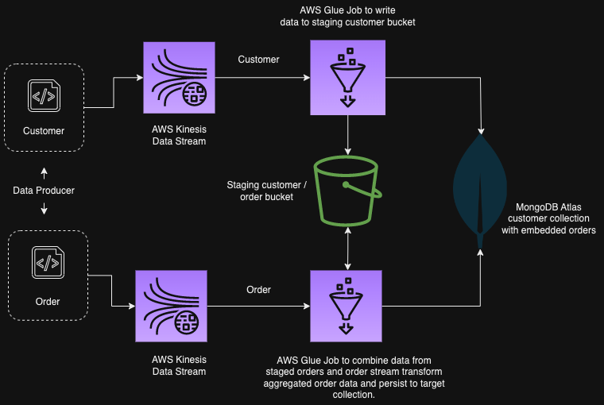

# Stream data into MongoDB Atlas using AWS Glue

## Introduction: 
It demonstrates the seamless integration of AWS Glue, AWS Kinesis, and MongoDB Atlas has emerged as a powerful solution for ETL (Extract, Transform, Load) operations, offering seamless data flow and efficient management across diverse environments.

It demonstrates a CDK app with an instance of a stack (`kinesis-glue-aws-cdk`)

## [MongoDB Atlas](https://www.mongodb.com/atlas) 
MongoDB Atlas is an all-purpose database having features like Document Model, Geo-spatial, Time Series, Hybrid deployment, and multi-cloud services.
It evolved as a "Developer Data Platform", intended to reduce the developers' workload  and management of the database environment.
It also provides a free tier to test out the application/database features.

## [AWS Glue](https://aws.amazon.com/glue/)

AWS Glue is a fully managed serverless data integration service that makes it easy to extract, transform, and load (ETL) from various data sources for analytics and data processing with Apache Spark ETL jobs. In this application, we will receive incoming requests from producers and process them using Glue Jobs to store them in S3 and MongoDB. Let us assume each request produces an event like the one shown below,

## [Amazon Kinesis](https://aws.amazon.com/kinesis/)

Amazon Kinesis cost-effectively processes and analyzes streaming data at any scale as a fully managed service. With Kinesis, you can ingest real-time data, such as video, audio, application logs, website clickstreams, and IoT telemetry data, for machine learning (ML), analytics, and other applications.
#
## Architecture Diagram:



#

1.  ## Prerequisites

    This demo, instructions, scripts, and cloudformation template are designed to be run in `us-east-1`. With a few modifications, you can try it out in other regions as well.

    -  AWS CLI Installed & Configured 
    -  AWS CDK Installed & Configured
    -  MongoDB Atlas Account 
    -  Python Packages :
      - Python3 - `yum install -y python3`
      - Python Pip - `yum install -y python-pip`
      - Virtualenv - `pip3 install virtualenv`

1.  ## Setting up the environment

    - Get the application code

      ```bash
      git clone https://github.com/mongodb-partners/Stream_Data_into_MongoDB_AWS_Glue
      cd kinesis-glue-aws-cdk
      ```

1.  ## Prepare the dev environment to run AWS CDK

    We will use `cdk` to make our deployments easier. Let's go ahead and install the necessary components.

    ```bash
    # You should have npm pre-installed
    # If you DONT have cdk installed
    npm install -g aws-cdk

    # Make sure you in root directory
    python3 -m venv .venv
    source .venv/bin/activate
    pip3 install -r requirements.txt
    ```

    ```bash
    cdk ls
    # Follow on-screen prompts
    ```

    You should see an output of the available stacks,

    ```bash
    aws-etl-kinesis-stream-stack
    aws-etl-bucket-stack
    aws-etl-glue-job-stack
    ```

1.  ##  Deploying the application

    Let us walk through each of the stacks,

    - **Stack: aws-etl-kinesis-stream-stack**

      This stack will create two kinesis data streams. Each producer runs for an ingesting stream of events for different customers with their orders. 

      Initiate the deployment with the following command,

      ```bash
      cdk deploy aws-etl-kinesis-stream-stack
      ```

      After successfully deploying the stack, Check the `Outputs` section of the stack. You will find the `CustomerOrderKinesisDataStream` kinesis function.

    - **Stack: aws-etl-bucket-stack**

      This stack will create an S3 bucket that will be used by Glue to persist the incoming customer and order details.

      ```bash
      cdk deploy aws-etl-bucket-stack
      ```

      After successfully deploying the stack, Check the `Outputs` section of the stack. You will find the `S3SourceBucket` resource.

    - **Stack: aws-etl-glue-job-stack**

      This stack will create two Glue Jobs. One job for the customer and another for order. The code is in this location `glue_job_stack/glue_job_scripts/customer_kinesis_streams_s3.py` and `glue_job_stack/glue_job_scripts/order_kinesis_streams_s3.py`

      ```bash
      cdk deploy aws-etl-glue-job-stack
      ```

    - ** Update AWS Glue Studio parameters**

    In Job Details tab, update the AWS Glue stuido advanced paramters for MongoDB Atlas URI, User Name and Password. Ensure the S3 location details are updated for "Spark UI logs path"  and "Temporary path"


    
Once you are ready with all stacks, start the producers for the customer and order The code is in this location

      `producer/customer.py` and `producer/order.py`
      
to ingest data into a kinesis data stream and also start the Glue job for both.


#

` Sample record in MongoDB Atlas:`

```json
{
  "_id": "1",
  "country_id": "1",
  "customer_name": "NICK",
  "email_id": "nick@gmail.com",
  "orders": [
    {
      "order_id": "8",
      "product_name": "Artisanal Cheese Selection",
      "quantity": "8",
      "price": "29.17"
    }
  ]
}
```
#

## Clean up

Use `cdk destroy` to clean up all the AWS CDK resources. 
Terminate the MongoDB Atlas cluster.


## Useful commands

 * `cdk ls`          list all stacks in the app
 * `cdk synth`       emits the synthesized CloudFormation template
 * `cdk deploy`      deploy this stack to your default AWS account/region
 * `cdk diff`        compare deployed stack with current state
 * `cdk docs`        open CDK documentation

Enjoy!
